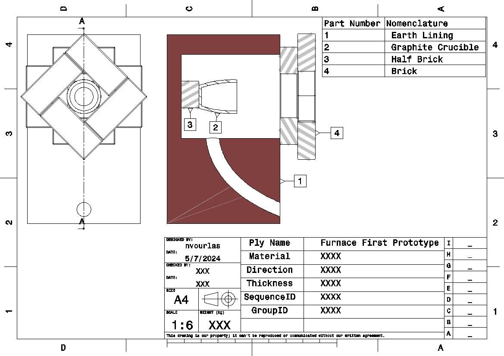
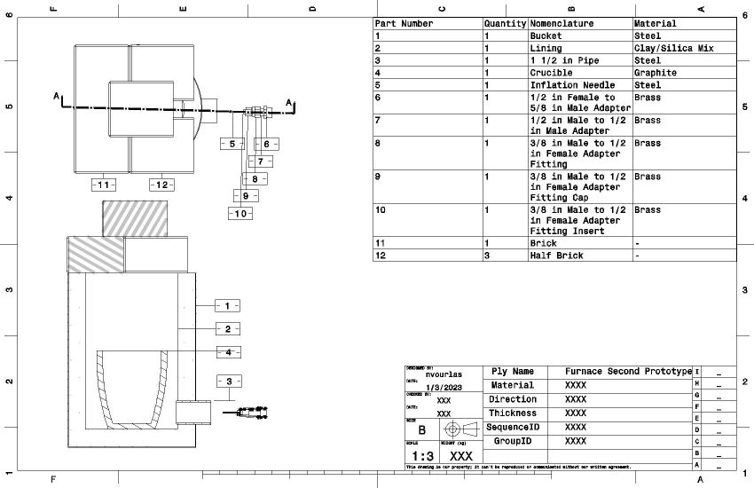
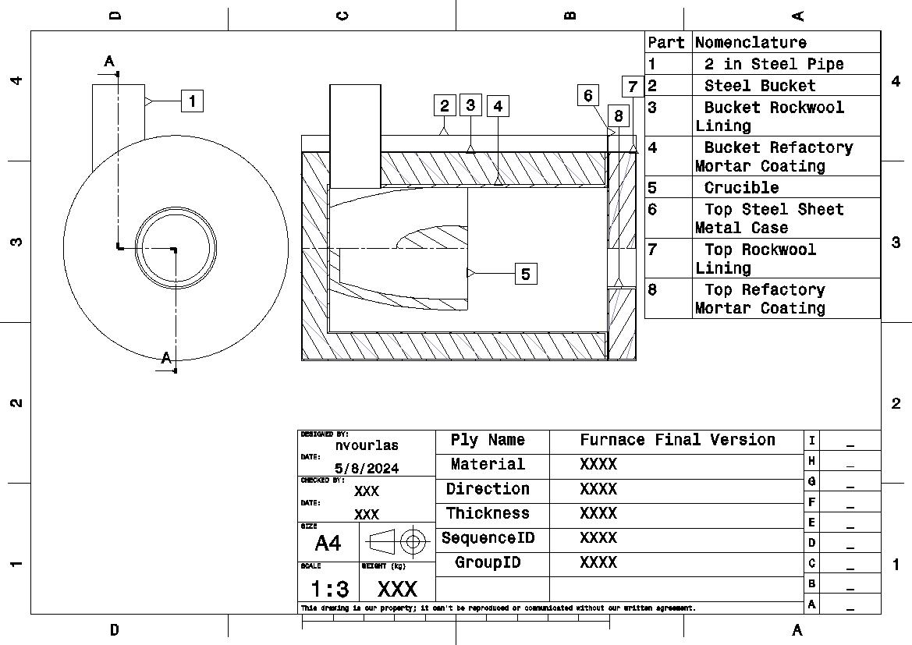
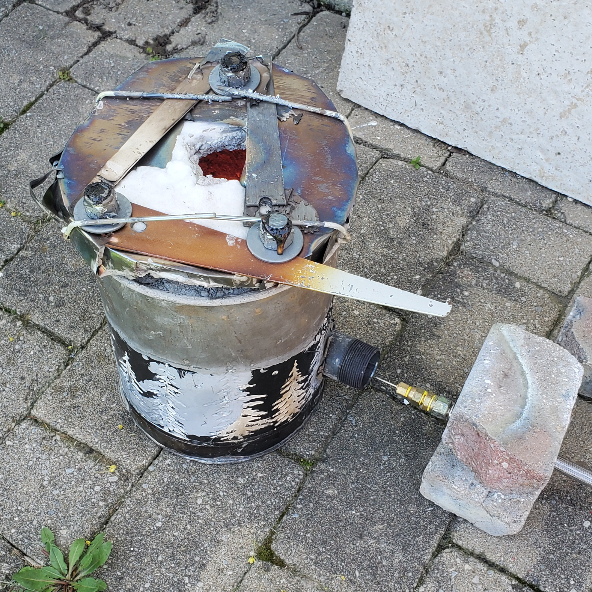
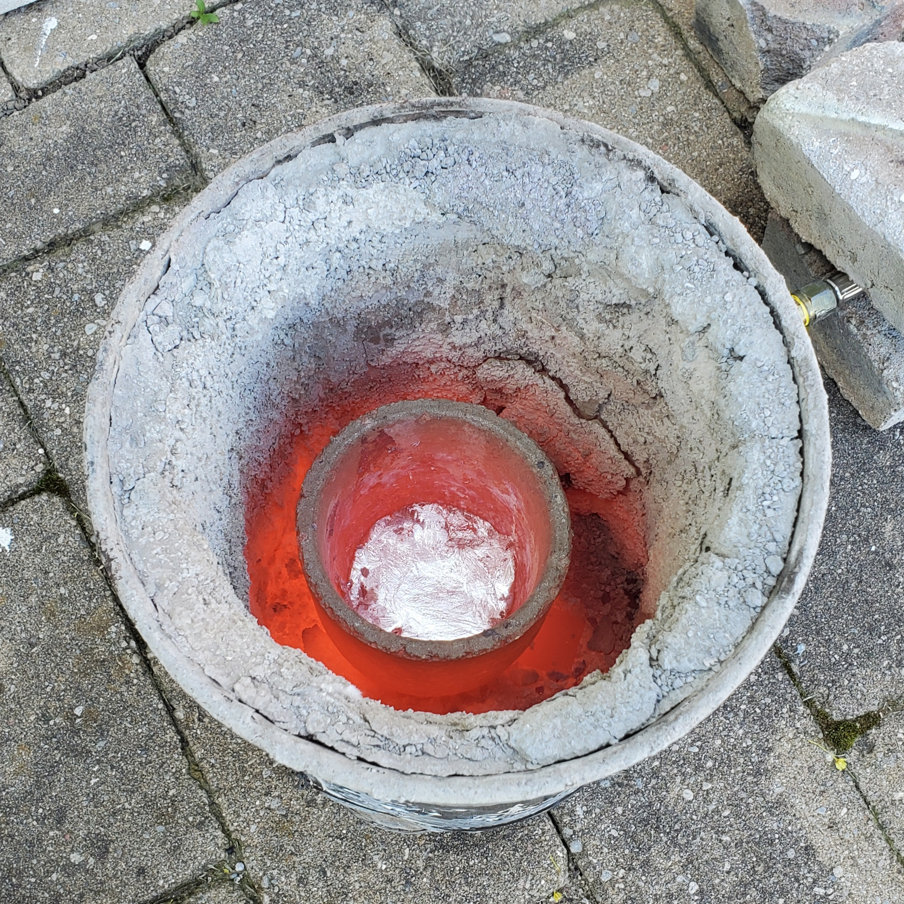
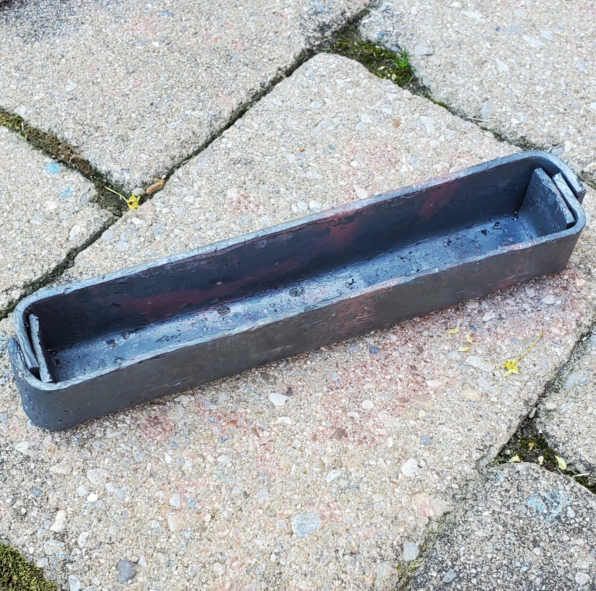
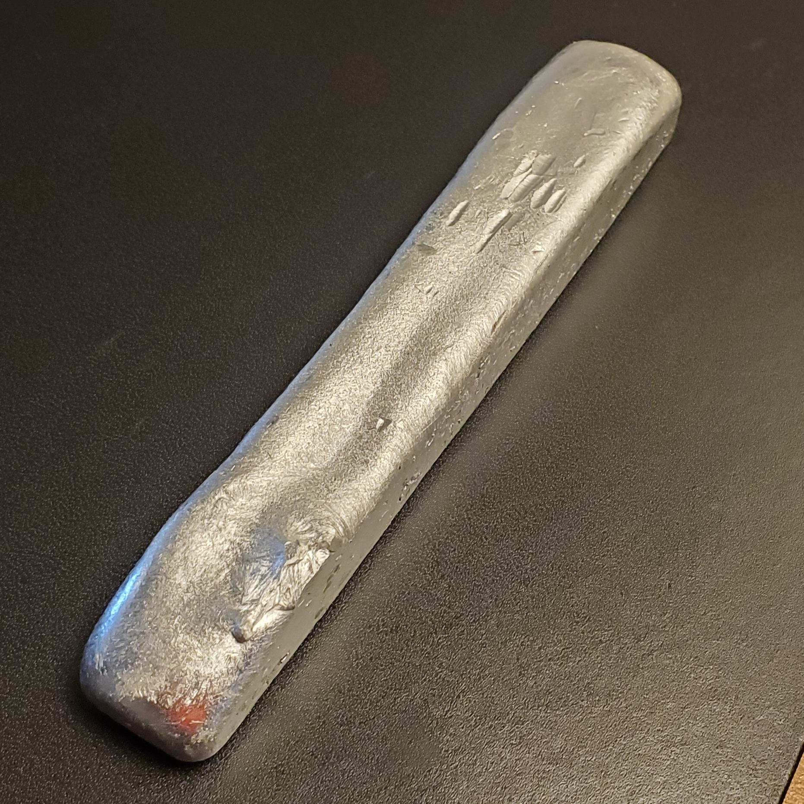

# Metal-melting Furnace
A custom-designed and manufactured enclosure and propane torch used to melt various metals.
# Initial Planning
The original goal of this project was to devise an easy method of casting aluminum to build other projects. With a melting point around 700 degrees, a standard fire or low-pressure torch would not suffice for this purpose. Therefore, a pressurised fuel or oxygen had to be supplied. Additionally, some sort of insulated container was needed to trap the immense heat necessary. Methods of casting would also have to be explored.

An additional requirement of this project was to use as basic materials as practical. This was done to reduce the project's cost in addition to provide knowledge of material properties and working techniques.
# First Prototype
The first prototype was a forced-air charcoal-burning furnace made in the ground. It had to be destroyed before this log was written, so only drawings are available. The reason such a setup was considered was for its ease of construction; it was a proof-of-concept. The plan comprised an insulating earthen cavity, a fire fed by wood or charcoal that lay around the brick that held the crucible, and a hole for a blower (shop vac in reverse) that supplied the fuel with sufficient oxygen to burn as hot as possible.

Advantages
- Able to melt aluminum
- Heated up crucible quickly

Disadvantages
- Too much smoke and ash were produced
- Produced poor quantity and quality of alumunim
- Opening the cover, stopping the blower, and taking out the crucible to refill the charcoal was inefficient and dangerous
- Inability to quickly extinguish and light fire made refilling and slag removal dangerous
- Cover was not stable
- Crucible was not durable or stable (steel can crucible was originally used)
- Smelter was not mobile
- The surrounding earth was a decent insulator, but had a very high mass and absorbed too much heat
- Convinced neighbors that the fires of hell had erupted from next-door backyard

<figure>
    <figcaption>Prototype One Assembly Drawing</figcaption>
    
</figure>

<figure>
    <figcaption>Crushed Cans Used for Aluminum</figcaption>
    
</figure>

# Second Protoype
The second prototype comprised a propane torch with its own insulated chamber. These ideas were inspired by small commercial metal furnaces, but made more accessible with basic materials. 

The insulating material of the chamber was a silicate comprising 30% clay (dug from the ground and refined via decanting) and the remainder crushed up glass bottles (measured by volume). This was done due to easy sourcing of the materials. A steel bucket was used to contain the insulating mixture. Standard bricks were used to cover the top when in use. The torch was made of plumbing hardware, teflon tape, and a 30 PSI regulator. The stoichiometric ratio of propane to oxygen could be optimised by changing the distance between the torch nozzle and the inlet pipe.

Advantages
- Refinement and casting of aluminum was faster and safer
- Insulation was much more effective and durable
- Furnace was mobile

Disadvantages
- Torch was cumbersome to light and position
- Shape of gas inlet led to inefficient burning (adapter pipe with differing diameter)
- Position of gas inlet led to inefficient gas flow and chamber heating (facing straight towards crucible rather than to the side)
- Chamber insulation and cover were not optimised and degraded over time
- Insulation was lighter and thinner than first prototype, but still heavy

<figure>
    <figcaption>Prototype Two Assembly Drawing</figcaption>
    
</figure>

<figure>
    <figcaption>Prototype Two</figcaption>
    
</figure>

<figure>
    <figcaption>Prototype Two Torch</figcaption>
    
</figure>

<figure>
    <figcaption>Prototype Two In Action</figcaption>
    
</figure>

<figure>
    <figcaption>Aluminum Ingots Produced by Prototype Two, Each 70mm</figcaption>
    
</figure>

# Final Version
The final version comprised an improved propane torch and insulated chamber. It was very similar to small commercial furnaces. The final version was adequate for the original purpose of the project, producing metal parts for other projects.

The silicate lining used in prototype two was removed from the steel bucket and replaced with a one-inch thick layer of mineral wool. The wool was coated in a refactory mortar to prevent fibres from flying off. An insulating lid was made in a similar manner from scrap steel sheet metal and spare hardware. A short 2-inch diameter pipe was placed alongside the inner wall of the furnace to allow the flame to flow around the crucible more effectively. The same torch developed for prototype two was used.

Advantages
- Able to melt aluminum, copper, brass, bronze, and others with a maiximum temperature around one-thousand degrees
- Able to heat steel to forging temperature
- Due to the improved insulation and torch, the furnace was much more effecient than previous versions
- Became hot and cooled off much faster than previous versions
- Much lighter than previous verions

Disadvantages
- Refactory mortar lining was too thin in some spots and caved in slightly
- Gaps between lid and body led to a loss of effeciency
- Furnace took an excessive amount of time to heat contents to its maximum temperature
- Torch was still cumbersome to light and position
- Lack of proper handle made the lid awkward to remove

<figure>
    <figcaption>Final Version Assembly Drawing</figcaption>
    
</figure>

<figure>
    <figcaption>Final Version</figcaption>
    
</figure>

<figure>
    <figcaption>Final Version in Action</figcaption>
    
</figure>

<figure>
    <figcaption>Forged Steel Ingot Mold Produced by Final Version</figcaption>
    
</figure>

<figure>
    <figcaption>Aluminum Ingot Produced by Final Version, 160mm</figcaption>
    
</figure>

<figure>
    <figcaption>Copper Ingot Produced by Final Version, 60mm</figcaption>
    
</figure>

# Conclusions
This was a very practical project that has unlocked the ability to create custom metal parts for future projects. It was ultimately cheaper than an equivalent commercial product but performs almost as well. It could be improved in many ways, mainly in regards to durability and ease of use. However useful the result may be, however, it is usually more costly in the fullness of time to produce every part of a project from scratch. Nonetheless, the project taught mold casting, sand casting, forging, and metalworking.
