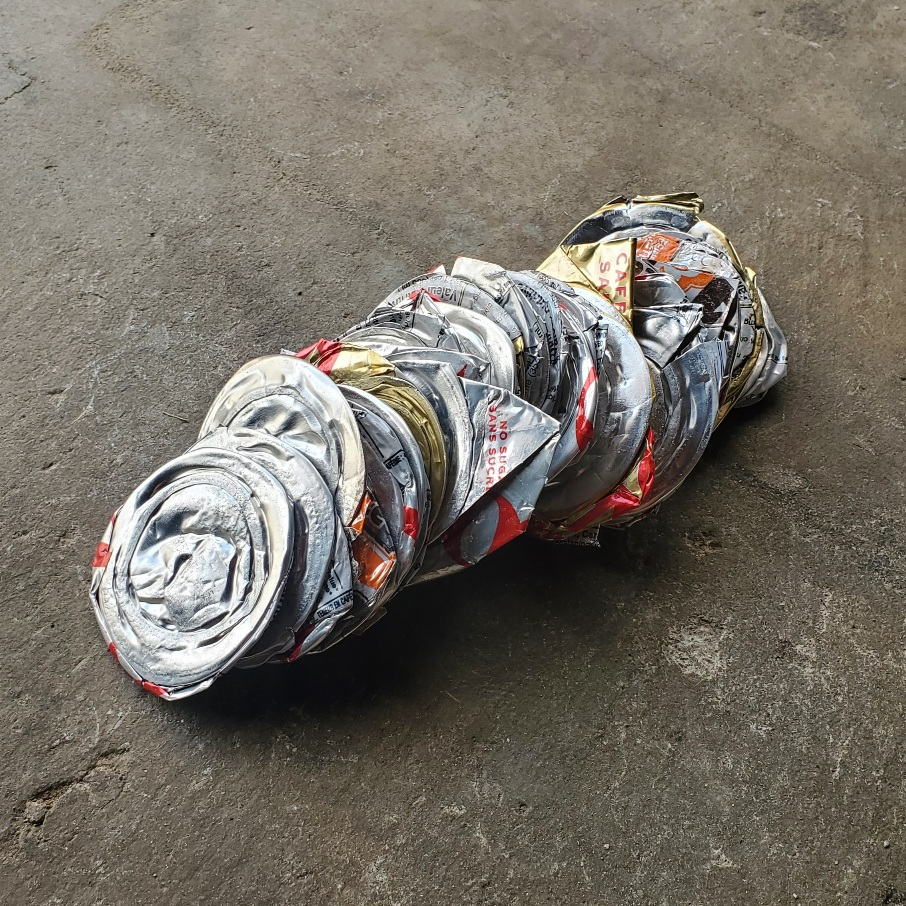
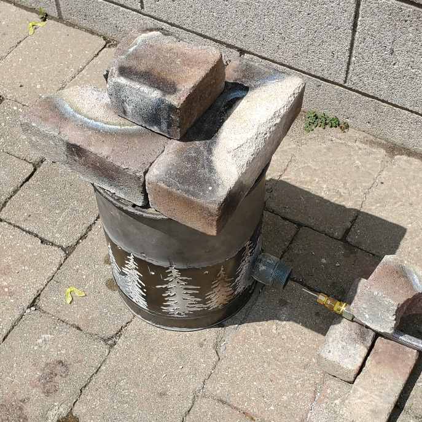
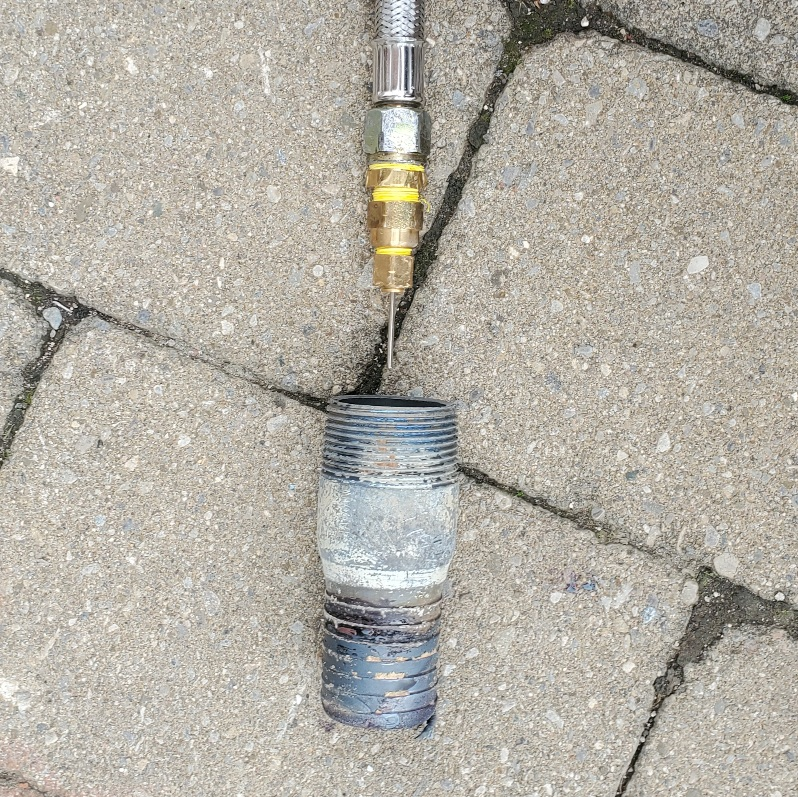
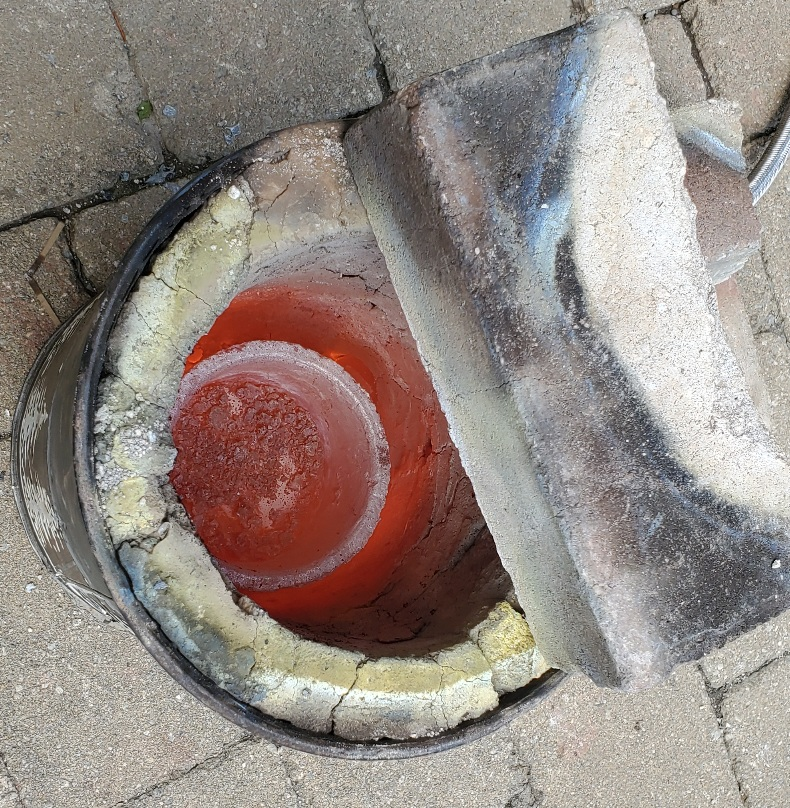
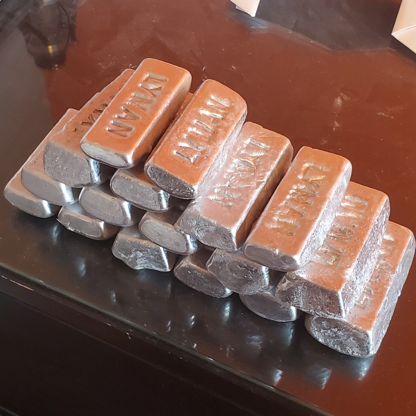
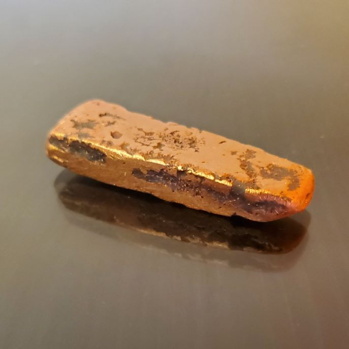

# Metal-Smelter
A custom-designed enclosure and propane torch used to melt various metals.
# Initial-Planning
The original goal of this project was to devise an easy method of casting aluminum to build other projects. With a melting point around seven hundred-degrees celcius, it was determined early that a standard fire or low-pressure torch would not suffice for this purpose. Therefore, it was known that a pressurised fuel or oxygen had to be supplied. Additionally, some sort of insulated container was needed to trap the immense heat necessary. 

An additional requirement of this project was to procure all materials used from as basic a form as practical. This was done to reduce the project's cost in addition to provide knowledge of material properties and working techniques.
# First Prototype
The first prototype was a forced-air charcoal-burning furnace made in the ground. It had to be destroyed before this log was written, so only drawings are available. The reason such a setup was considered was for its ease of construction; it was a proof-of-concept.

As per the following drawing, the plan comprised an insulating earthen cavity, a fire fed by wood or charcoal, and a blower that supplied the fuel with sufficient oxygen to burn as hot as possible.
(first drawing)

This design did fufill its purpose, albeit just barely. The aluminum produced was not of great volume or quality (mixed in with slag) and the process of use was very awkward.

Advantages
- Able to melt aluminum
- Heated up crucible quickly

Disadvantages
- Too much smoke and ash were produced
- Opening the cover, stopping the blower, and taking out the crucible to refill the charcoal was inefficient and dangerous
- Inability to quickly extinguish and light fire made refilling and slag removal dangerous
- Cover was not stable
- Crucible was not durable or stable
- Smelter was not mobile
- The surrounding earth was a decent insulator, but had a very high mass and absorbed too much heat
- Convinced neighbors that the fires of hell had erupted from next-door backyard

<figure>
    <figcaption>Crushed Cans Used for Aluminum</figcaption>
    
</figure>

# Second Protoype
The second prototype was a propane torch with its own insulated chamber. These ideas were inspired by many commercial smelters. 

The insulating material of the chamber, instead of fiberglass or mineral wool, was a silicate comprising thirty-percent clay and the remaining crushed up glass bottles was used (measured by volume). This was done due to easy sourcing of the materials. A steel bucket was used to contain the insulating mixture. Standard bricks were used to cover the top when in use. The torch was made of plumbing hardware, teflon tape, and a thirty-PSI regulator.

Advantages
- Refinement and casting of aluminum was faster and safer
- Insulation was much more effective and durable

Disadvantages
- Torch was cumbersome to light and position
- Shape of gas inlet led to inefficient burning
- Position of gas inlet led to inefficient gas flow and chamber heating
- Chamber insulation and cover were not optimised and degraded over time
- Insulation was lighter and thinner than first prototype, but still heavy

<figure>
    <figcaption>Prototype Two</figcaption>
    
</figure>

<figure>
    <figcaption>Prototype Two Torch</figcaption>
    
</figure>

<figure>
    <figcaption>Prototype Two In Action</figcaption>
    
</figure>

<figure>
    <figcaption>Aluminum Ingots Produced by Prototype Two</figcaption>
    
</figure>

# Third Prototype
The third protoype was an improved propane torch and insulated chamber.

The silicate lining used in prototype two was removed from the steel bucket and replaced with a one-inch thick layer of mineral wool. The wool was coated in a refactory mortar to prevent fibres from flying off. An insulating lid was made in a similar manner from steel sheet metal and hardware. A short, straight pipe was placed alongside the inner wall of the furnace. The same torch developed for prototype two was used.

Advantages
- Able to melt aluminum, copper, brass, bronze, and others with a melting temperature around one-thousand degrees
- Due to the improved insulation and torch, the furnace was much more effecient than previous versions
- Became hot much faster than previous versions
- Much lighter than previous verions

Disadvantages
- Refactory mortar lining was too thin in some spots and caved in slightly
- Gaps between lid and body led to a loss of effeciency
- Furnace took an excessive amount of time to heat contents to approximately one-thousand degrees
- Torch was still cumbersome to light and position
- Lack of proper handle made the lid awkward and dangerous to remove

<figure>
    <figcaption>Copper Ingot Produced by Prototype Three</figcaption>
    
</figure>
